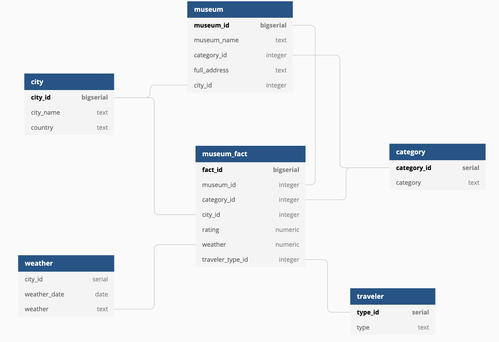
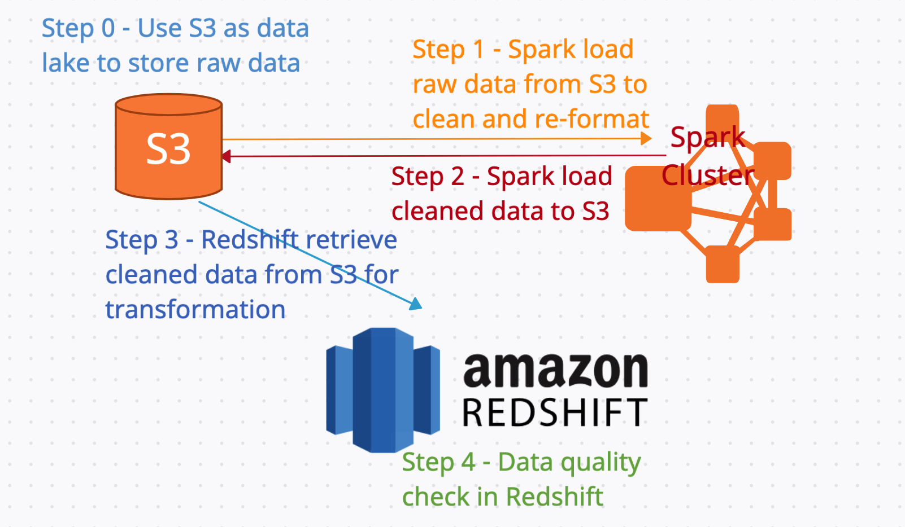

## Project summary
This project collects and presents information about museums (US only at current stage, will extend to global in next pharse), including museum categories, locations, ratings and more. 

Output can be used by travelers, museum fans and travel companies for trip planning, as well can be used by museum marketing department and data analysts for study and analyse.

## Project structure
This reposity contains following materials:

1. **`aws.cfg`** contains all configuration parameters. Please input following parameters before executing the ETL pipeline.

2. **`helper`** foler contains following helper functions:

	- `create_drop_tables.py` drop and creat redshift tables
	- `data_quality.py` data quality check
	- `sql_queries.py` all sql queries used in this project
	- `transform_data.py` functions to process data and transform table
	
	
3. **`etl.py`** is the ETL pipleline

4. **`small_dataset`** datasets in smaller size for testing purpose

5. **`awesome-museum.ipynb`** is a Jupyter notebook for testing and can be used as dashboard.


## Instruction
Please follow below steps to run this project:

**Step 1: Fill in `aws.cfg`**
	
```
[KEYS]
AWS_ACCESS_KEY_ID=<your_access_id>
AWS_SECRET_ACCESS_KEY=<your_access_key>
	
[CLUSTER]
HOST=<your_redshift_host>
DB_NAME=<your_redshift_db_name>
DB_USER=<your_redshift_db_user>
DB_PASSWORD=<your_redshift_db_password>
DB_PORT=5439
	
[IAM_ROLE]
ARN=<your_arn>
	
[FILTER]
COUNTRY=United States
DATE=2012-10-01
```

Notes for [FILTER] section:

- for COUNTRY, we only have dataset for United States at current stage. 
- for DATE, we only have dataset up to 2013-09-01, every first day of each month.


**Step 2: Remove folder `museum-output` and `weather-output` if they already exist in your S3 directory.**

**Step 3: Execute `etl.py`**

Note: You may change to use smaller size source dataset in `small_dataset` for testing.

## Source data
Datasets are collected from Kaggle and Tripadvisor and are uploaded to AWS S3 `s3://udacity-dend-shell845/museum-data/`

**museum** overall summary of museums extracted from Tripadvisor. In csv format.

```
mid,Address,Description,FeatureCount,Fee,Langtitude,Latitude,LengthOfVisit,MuseumName,PhoneNum,Rank,Rating,ReviewCount,TotalThingsToDo
0,"555 Pennsylvania Ave NW, Washington DC, DC 20001-2114","Find out for yourself why everyone is calling the Newseum the best experience Washington, D.C. has to offer. Each of the seven levels in this magnificent building is packed with interactive exhibits that explore free expression and the five freedoms of the First Amendment: religion, speech, press, assembly and petition. Whether you have just a few hours or want to spend all day, you'll find something for everyone in the family in the Newseum's 15 theaters and 15 galleries.",3,Yes ,-77.0192351,38.8931385,2-3 hours ,Newseum,+1 888-639-7386,8,4.5,"6,309",398
```
	
**category** categories of museums, e.g. art museum, history museum, science museum etc. In json format.
	
```
{'museum': ['museum type 1','museum type 2', …]}
{"Gettysburg Heritage Center": ["History Museums", "Museums"]}
```

**rating** how many ratings did the museums receive and what are the ratings. In json format.
	
```
{'museum': ['Excellent','Very good','Average','Poor','Terrible']}
{"Gettysburg Heritage Center": ["164", "63", "10", "5", "4"]}
```
	
**traveler** how the travers travel. In json format.
	
```
{'museum': ['Families','Couples','Solo','Business','Friends']}
{"Gettysburg Heritage Center": ["88", "86", "17", "2", "33"]}
```

**weather** average tempature of the cities where the museums are located. In csv format.

```
dt,AverageTemperature,AverageTemperatureUncertainty,City,Country,Latitude,Longitude
2008-01-01,10.915999999999999,0.165,Pasadena,United States,29.74N,96.00W
```

## Data model
### Staging table
`staging_category` load data from **category**

| Field Name | Data Type | Description                          | Example                      |
|------------|-----------|--------------------------------------|------------------------------|
| museum     | text      | museum name                          | National Museum of Arts      |
| category   | text      | museum category                      | Arts Museum                  |

`staging_traveler` load data from **traveler**

| Field Name | Data Type | Description                          | Example                      |
|------------|-----------|--------------------------------------|------------------------------|
| museum     | text      | museum name                          | National Museum of Arts      |
| type       | text      | traveler type                        | Business                     |
| number     | integer   | number of travelers                  | 283                          |

`staging_weather` load data from **weather**

| Field Name | Data Type | Description                          | Example                      |
|------------|-----------|--------------------------------------|------------------------------|
| dt         | date      | weather date                         | 2013-10-01                   |
| averageTemperature | FLOAT | average temperature of this month| 18.39                        |
| city       | text      | city                                 | Toronto                      |
| country    | text      | country                              | Canada                       |

`staging_museum` load data from **museum**

| Field Name | Data Type | Description                          | Example                      |
|------------|-----------|--------------------------------------|------------------------------|
| museumname | date      | museum name                          | National Museum of Arts      |
| rating     | FLOAT     | overall rating of the museum         | 4.6                          |
| city       | text      | city                                 | Toronto                      |
| address    | text      | full address of the museum           | Canada                       |


### Fact table
#### `museum_fact`

| Field Name | Data Type | Description                          | Example                      |
|------------|-----------|--------------------------------------|------------------------------|
| fact_id    | bigserial | primary key, id of the museum fact   | 2904                         |
| museum_id  | integer   | museum id                            | 38                           |
| city_id    | integer   | city id of museum location           | 72                           |
| category_id| integer   | id of museum category                | 2                            |
| rating     | numeric   | average rating given by visitors     | 4.7                          |
| traveler_type_id|integer| id of visitor type                  | 3                            |
| weather    | numeric   | average temperature of the city      | 17.4                         |
| dt         | date      | weather date                         | 2013-10-01                   |


### Dimension table
#### `city`
| Field Name | Data Type | Description                 | Example      |
|------------|-----------|-----------------------------|--------------|
| city_id    | bigserial | primary key, unique city id | 28           |
| city_name  | text      | city name                   | New York     |
| country    | text      | city country                | United State |

#### `category`
| Field Name  | Data Type | Description                            | Example     |
|-------------|-----------|----------------------------------------|-------------|
| category_id | serial    | primary key, unique id of the category | 29          |
| category    | text      | museum category                        | Arts museum |

#### `traveler`
| Field Name | Data Type | Description   | Example  |
|------------|-----------|---------------|----------|
| type_id    | serial    | primary key   | 1        |
| type       | text      | traveler type | Families |

#### `weather`
| Field Name | Data Type | Description                    | Example    |
|------------|-----------|--------------------------------|------------|
| city_id    | integer   | refers to city_id of city      | 1          |
| weather_date| date     | date of weather                | 2019-06-01 |
| weather    | numeric   | average temperature in celsius | 17.8       |

#### `museum`
| Field Name   | Data Type | Description                   | Example                        |
|--------------|-----------|-------------------------------|--------------------------------|
| museum_id    | bigserial | primary key, unique museum id | 281                            |
| museum_name  | text      | museum name                   | The Metropolitan Museum of Art |
| category_id  | integer   | what type of museum           | 2                              |
| full_address | text      | full address of the museum    | 1000 Fifth Avenue              |
| city_id      | integer   | city id                       | 827                            |
| rating       | numeric   | average rating given by visitors   | 4.7                       |
| traveler     | text      | the museum is most popular among which traveler group | 4.7    |


### DB diagram


## ETL pipeline
The ETL pipeline includes following steps:

1. Clean and re-format raw data
	- Load raw data for **museum** and **weather** from S3 to Spark, since these 2 datasets are too big to be processed directly in Redshift.
	- Clean **museum** and **weather** raw data with Spark, output transformed data to S3 as parquet files.
	- Clean and re-format **category** and **traveler** dataset, output re-formatted data to S3 as json files.
2. Load cleaned and well-formatted dataset from S3 to Redshift staging tables.
3. Conduct data quality check to ensure data are loaded succesfully to Redshift.
4. Transform staging tables to fact and dimension tables in Redshift.
5. Perform data quality check to ensure data transformation is correct.



## Data quality check
Check record counts of each data to ensure data are properly processed. Can select and display sample data if want further exam the data quality.

## Tools and technologies
S3, Spark and Redshift are use in this project.

Will further adopt Airflow for pipeline management in next pharse.

## Usage
Museum lovers can make reference to the project dataset for their trip plannings.

Travel agencies can make use of this project for travel recommendations as well.

Data analysts from travel industry can use this project output to predict if a museum will be popular with market, and study what factors make a museum popular.

Museum staff can get intuitve feedback on how visitors view their museum.


## Other scenarios
1. If the data was increased by 100x.

	Spark will be used to process all raw datasets. Redshift cluster will be expanded.

2. If the pipelines would be run on a daily basis by 7 am every day.

	Airflow will be used for pipelines scheduling.

3. If the database needed to be accessed by 100+ people.

	If those people only need to view the project result, then they should not access the database directly. Instead the result will be visualized by visualization tool e.g Tableau, Power BI etc. Only the visualization tool access database, people only check results from the tool.
	
	If those people need read write to the database, an IAM group will be assigned to them.

## Next phase
1. Adopt Airflow for pipeline management.
2. Visualize the data.
2. Extend the dataset to including reviewer comments, study the relationship between rating and different key words in the comments.

 